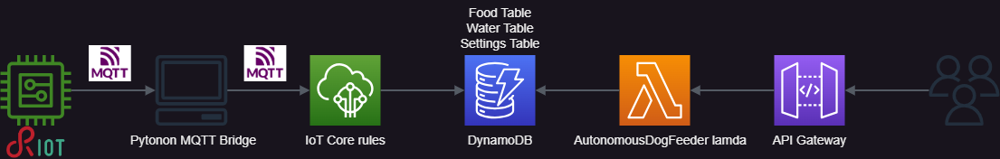

# Autonomous-Dog-Feeder

## What is the problem and why do you need IoT?

### Problems we want to solve

#### Main problem

- During the summer, some families leave their dogs because they do not have the opportunity or the desire to move with them. (data not found but a lot of news reports every year in the summer are released).
Duration:  
La maggior parte sceglie di andare via tra giugno, luglio e agosto per periodi anche abbastanza lunghi: il 59% ha infatti indicato dalle 4 alle 7 notti via. Da considerare che la media 2021-2022 delle vacanze degli italiani nel periodo estivo è stata di 4 notti ([source](https://www.nostrofiglio.it/bimbi-in-viaggio/turismo-family-in-italia#:~:text=La%20maggior%20parte%20sceglie%20di,%C3%A8%20stata%20di%204%20notti.)). Then, to help dogs and families in this problem, we want to provide an autonomous dog feeder able to feed the pet for at least 7 days. The goal of this project is to build a reliable alternative to the neglect of dogs during the summer.

#### Related problems

- Dogs have a daily amount of food they need to eat, according to their age, activity level, and health condition. This amount of food is suggested by the vet or written on the dog food package. We want to make sure that the dog gets the right amount of food every day.
- Dogs need to eat their food several meals throughout the day. Each meal should be served at a specific time, according to the dog's age and activity level or preference. We want to make sure that the dog gets the right amount of food at the right time.
- Dog owners may not be able to feed their dogs on time due to work or other commitments.
- Water is essential for dogs. We want to make sure that the dog has access to water at all times.
- We want to monitor the trends of the dog's eating habits and water consumption, to support the medical diagnosis.

### How we can monitor the environment?

- Food:
  - We want to measure the amount of dry food to pour in the bowl, to be able to define the amount of food for each meal. We can use a load cell sensor to measure the weight of the food.
- Water:
  - We want to measure the amount of water left in the bowl.

### Sensors

- **Load cell** sensor to measure the weight of the food in the bowl.
Periodic sensing is required to measure over time the quantity of food in the bowl.
(**Identify a suitable sensor data prediction model.**)
- **Load cell** sensor to measure the weight of the water in the bowl to quantify the liters of water in the bowl (the density of the water is about 1 Kg/L, considering the temperature of the water at room temperature and the pressure at sea level).
Periodic sensing is required to measure over time the quantity of water in the bowl.
(**Identify a suitable sensor data prediction model.**)
- **Button** to start or stop the autonomous dog feeder.

### Actuators

- A **servo motor** to open and close the recipient of the food.
The activation of the servo motor will be triggered by the cloud-based service only the bowl can contain the required amount of food.
- A **servo motor** to shake the recipient of the food. The activation of the servo motor will be triggered by the cloud-based service only the bowl can contain the required amount of food.
- A **water pump** fills the bowl with the water.
The activation of the water pump will be triggered by the load cell sensor only when the bowl doesn't contain the required amount of water.

## What data are collected and by which sensors?

We want to collect the food and water consumption of the dog, during the day. By observing the sample data on load cells, we want to compute locally the amount of food and water consumed by the dog. Then, we want to send the computed data to the cloud-based service to store them and make them available to the dog owner.

### Sensors accuracy, the unit of measurement and periodicity

- The **load cell** sensor to measure the weight of the food in the bowl has a capacity of 5 Kg since the 1 Kg load cell is not suitable for large breeds of dogs.
Large breeds of dogs eat about 600/700 g of food per day divided into two or three meals(the amount of food is written on the dog food package). But in special cases, like pregnancy or lactation, the food quantity can be three times the normal amount. So, if a pregnant dog eats 2.1 Kg of food per day divided into two meals, a 1 Kg load cell can not be suitable for this case. More, the tare i.e. the weight of the bowl should be considered too.  
Also, we can support the fact that the resolution of the 5 Kg load cell is good enough for our purpose. The ESP32 is connected to the load cell via the HX711 amplifier, which has a resolution of 24 bits. This means that the load cell can measure the weight of the food in the bowl with a resolution of 5/2^24 = 0.0000003 Kg = 0.0003 g.
The chosen unit of measurement is grams (g) and is set using a calibration factor.
To choose the periodicity of the sensing we need to consider the fact that we are interested in monitoring the dog's eating habits, like at which time the dog starts eating considering that the food is scheduled to be served at a specific time, and the speed of eating the food in the bowl. So, to reconstruct the dog's eating velocity, we can consider that a large breeds dog finishes its meal in a maximum of 5 minutes.
Considering the sampling theorem, we need to sample every at least 2.5 minutes, but some dogs eat faster than others, in particular puppies can finish their meal in about 1 minute. So, we can choose a sampling period of 30 seconds.
This approach is a good start because we don't know a priori the eating habits of a specific dog, so we want to oversample at the beginning and then we can adjust the sampling period according to the dog's eating habits.
Finally, when the dog ends its meal we can stop the sensing until a new scheduled meal is served.
- The **load cell** sensor to measure the weight of the water in the bowl has a capacity of 5 Kg since the weight of the bowl can saturate the 1 Kg load cell.
The chosen unit of measurement is liters (L) and is set using a calibration factor since we can assume 1 Kg = 1 L.
To choose the periodicity of the sensing we need to consider the fact that we are interested in having water in the bowl at all times and monitoring the dog's water consumption habits, like how much water the dog drinks during the day.
So, to have water in the bowl at all times, we can consider that the dog drinks continuously for a maximum of 30 seconds and after that, the bowl can be empty, so we need to refill it.
Considering that we don't want that the water bowl refilled while the dog is drinking, we can choose a sampling period of 30 seconds.
  
### Collected data velocity, variability and variety

- Food data: the velocity of the data is one sample every 30 seconds, but only if the bowl is not empty and the dog has eaten something, otherwise the data is not collected (variability). The variety of data goes from the weight of a single meal, specified by the dog owner, to 0 g excluded. Peaks in the weight of the food can be caused by the dog pressing the bowl while eating.
- Water data: the velocity of the data is one sample every 30 seconds, but only if the dog has drunk something, otherwise the data is not collected (variability). The variety of data goes from the capacity of the bowl, defined by the vendor of the autonomous dog feeder, to 0 L excluded. Peaks in the weight of the water can be caused by the dog pressing the bowl while drinking.

### Data analysis

- Local data analysis: every sample is analyzed locally to check if something strange is happening, like:
  - If the weight of the food or the liters of water is negative, then we can assume there is an accuracy error in the sensor, so we can set the value to 0.
  - If the weight of the food is greater than the poured one, then we can assume that the dog is pressing the bowl while eating, so we can discard the sample.
  - If the water is greater than the poured one, then we can assume that the dog is pressing the bowl while drinking, so we can discard the sample.
  - If the servo motor is activated but the weight of the food is not increasing after a time defined by the distance between the recipient of the food and the bowl, then we can assume that the recipient of the food is empty, so we need to notify the dog owner.
  - If the water pump is activated but the weight of the water is not increasing after a time defined by the distance between the recipient of the water and the bowl, then we can assume that the recipient of the water is empty, so we need to notify the dog owner.
  - If we want to pour x grams of food, then we need to continuously monitor the weight of the food in the bowl and stop the servo motor when the weight of the food reaches x grams.
  - If we want to pour y liters of water, then we need to continuously monitor the weight of the water in the bowl and stop the water pump when the weight of the water reaches y liters.

- Collective data analysis: we expect to obtain similar habits for dogs with the same characteristics, like breed, age, weight, etc. So, we can use the data collected from all the dogs to predict the eating habits of a new dog with similar characteristics.

### Data predicion model

### Data aggregation on the edge

Federeting learning: we can use the data collected from the single dog to build a partial model, and share the parameters of the model with the cloud-based service to build a global model, using all the partial models from all the dogs.
The global model should consider the characteristics of the dog, like breed, age, weight, etc. to predict the eating habits of a new dog with similar characteristics.
With this approach, we can avoid sending the data to the cloud-based service, but only the parameters of the partial model, to preserve the privacy of the dog and minimize the energy consumption of the device; since sending only the parameters of the partial model is less energy consuming than sending the data.

### Data aggregation on the cloud

Another approach is to send the data to the cloud-based service and build the global model there. In this case, we need to consider the privacy of the dog and the greater energy consumption of the device.

## What are the connected components, the protocols to connect them and the overall IoT architecture?

### Network diagram

Data are collected from the load cell sensors via the HX711 amplifier, which is connected to the ESP32. The ESP32 makes some local data computation and sends the data to an MQTT bridge via the MQTT protocol. The MQTT bridge sends this data to an AWS endpoint. This AWS endpoint implements some rules to store the data in a DynamoDB table. Finally, the data are visualized on a web page using the AWS API Gateway which triggers a Lambda function to query the DynamoDB table and return the web page. [Web site](https://6qxfwqry1k.execute-api.us-east-1.amazonaws.com/prod/autonomous-dog-feeder)

### Software components

- Device level:
  - Food dispenser: at a given schedule, the ESP32 will shake the first servo to avoid the food getting stuck in the dispenser, then it will activate the second servo to pour the food into the bowl. The ESP32 will monitor the weight of the food in the bowl through the load cell and close the second servo when the weight of the food reaches the desired value (food per day/number of meals per day). Then the ESP32 will stop the first servo.
  - Food data computation: consider the first meal, the bowl will be filled with food, so when we sample a weight smaller than the weight of the previous sample, we can assume that the dog has eaten something, so we can compute the weight of the food eaten by subtracting the weight of the previous sample from the weight of the current sample. Then we will send this data to the cloud-based service. If the bowl is empty, then we can assume that the dog has finished its meal, so we can stop the sensing until a new scheduled meal is served.
  - Water dispenser: we want that the bowl is always filled with water at a certain level. So, at the first activation, the ESP32 will activate the water pump to fill the bowl with water and stop the water pump when the weight of the water reaches the desired value (water bowl capacity), using the load cell to monitor the weight of the water in the bowl. If the weight of the water bowl reaches a certain level (water bowl capacity/2), then the ESP32 will activate the water pump to fill the bowl with water and stop the water pump when the weight of the water reaches the desired value (water bowl capacity), using the load cell to monitor the weight of the water in the bowl.
  - Water data computation: when we sample a weight smaller than the weight of the previous sample, we can assume that the dog has drunk something, so we can compute the weight of the water drunk by subtracting the weight of the previous sample from the weight of the current sample. Then we will send this data to the cloud-based service.
- Cloud level:
  - Lambda data query: the Lambda function will query the DynamoDB table selecting the samples in a given interval of time.
  - Lambda data computation: the Lambda function will compute the sum of the food eaten and the sum of the water drunk in a given interval of time.
  - Lambda data visualization: since we send only the samples with a value greater than 0, we need to add to these samples the samples with a value equal to 0, to have a complete visualization of the data. Then the Lambda function will return a web page with the data computed.

### Software architecture

## Other resources

- [hackster.io]()
- [YouTube]()